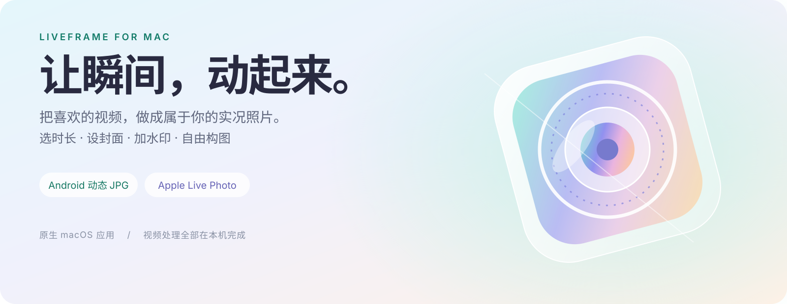
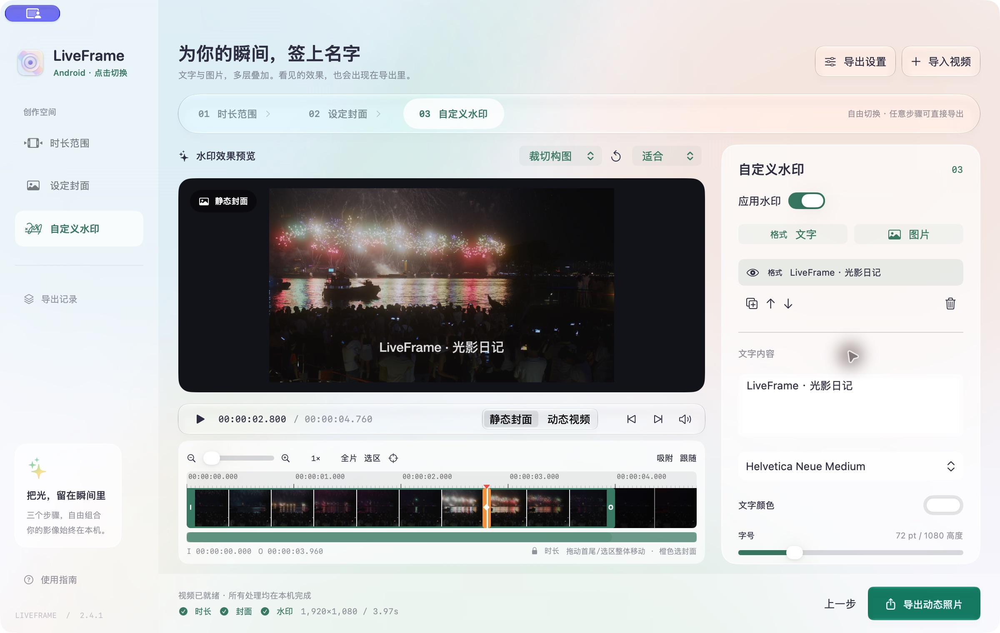
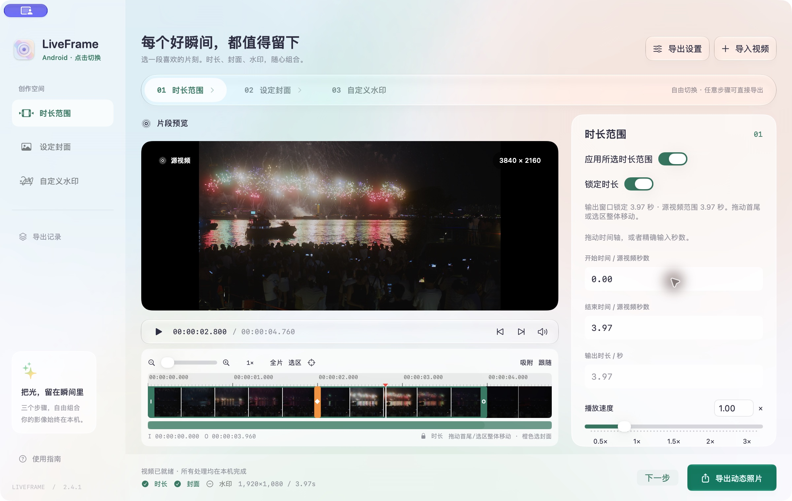
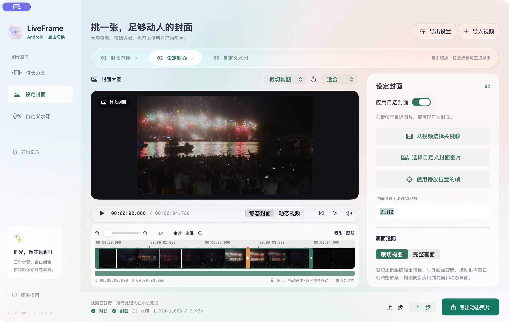
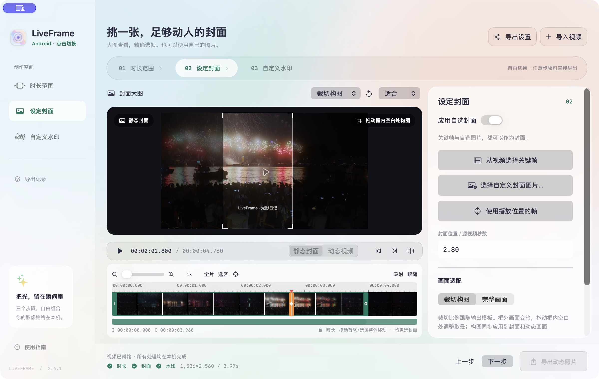
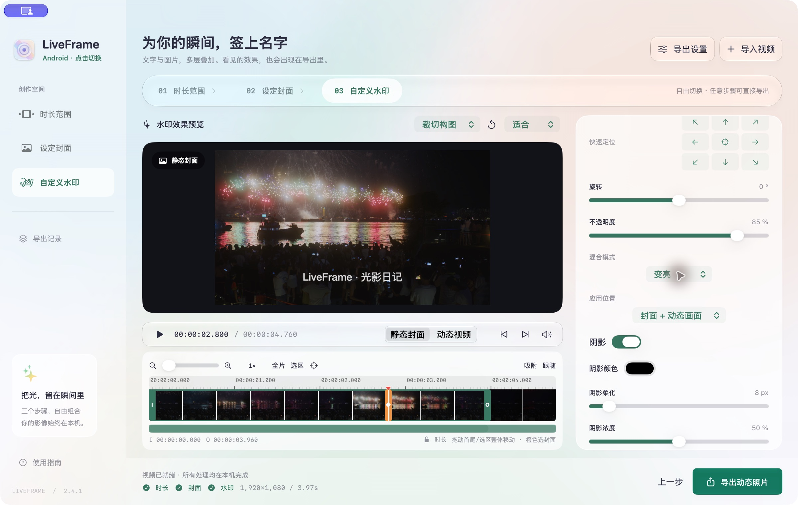
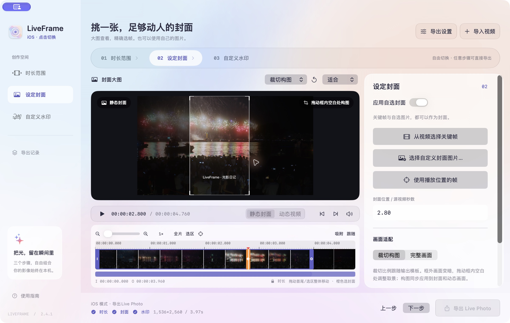
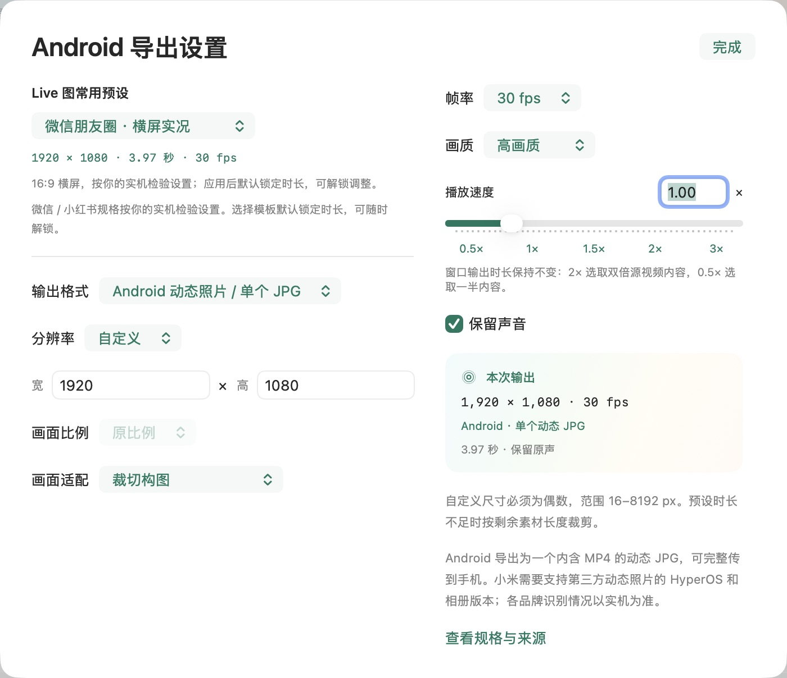

# LiveFrame

### 把喜欢的视频，做成属于你的实况照片。

一段烟花、一眼风景、一次回眸。选出最好的几秒，定下封面，签上名字，让照片留住动作与声音。

**原生 macOS 应用 · Android / iOS 双模式 · 大图构图 · 多层水印 · 本机处理**

**[下载 macOS 安装包](https://github.com/ARCHIC001/LiveFrame/releases/latest)**　 ·　 [安装指南](INSTALL.md)　 ·　 [反馈问题](https://github.com/ARCHIC001/LiveFrame/issues)

Apple 芯片 Mac · macOS 13 及以上 · 已内置 FFmpeg

## 从一段视频，到一张会动的照片

LiveFrame 将视频片段制作为 **Android 单文件动态 JPG** 或 **Apple Live Photo**。你可以控制实况时长、起止帧、播放速度、封面、构图、分辨率和水印，也可以导出普通 MOV 与循环 GIF。

| 你想做什么 | LiveFrame 帮你完成 |
| :--- | :--- |
| 从长视频中挑出几秒精彩片段 | 可缩放时间轴、逐帧定位、锁定时长后整体移动选区 |
| 为朋友圈或小红书准备实况素材 | 常用时长与尺寸模板，横屏、方形、竖屏和 3:5 全屏构图 |
| 把横屏画面变成竖屏作品 | 固定比例构图框自由移动，框外画面变暗但仍可查看 |
| 选一张更好看的封面 | 视频精确选帧，或导入自己的图片，大图检查细节 |
| 为作品加署名或 Logo | 系统字体、透明图片、多图层、混合模式与阴影 |
| 在不同手机生态中使用 | Android / iOS 模式切换时，同步切换主题和实况封装 |

## 三个步骤，按你的创作习惯组合

### 01 · 选时长。把最好的几秒留下来。

导入视频，拖动首尾手柄选出片段；需要更精确时，直接输入开始、结束时间或逐帧定位。长视频可以放大时间轴、横向平移、定位播放头，快速切换「全片」与「选区」视野。拖动起止手柄时，预览显示该手柄对应的源视频帧。

- **模板时长默认锁定**：拖动首帧、尾帧或选区，整段一起移动；在长视频里寻找画面时，时长保持不变。解锁后可自由调整首尾。
- **0.5×–3× 倍速**：保持输出窗口时长，改变取样的源视频范围。例如 3 秒输出窗口在 2× 下播放 6 秒素材，在 0.5× 下播放 1.5 秒素材。
- **听见原来的瞬间**：保留原声或静音；动态预览同步播放声音与倍速。
- **更顺手的操作**：滚轮平移、Option＋滚轮或触控板捏合缩放，拖动到边缘自动滚动；支持播放头跟随与吸附。

### 02 · 设封面。第一眼，就足够动人。

使用视频里的一帧，或选择一张独立图片。大图预览支持放大检查，封面时间可以精确到源视频帧；既能用当前播放位置，也能通过时间轴和数值选帧。

**构图不必只选正中间。** 选择「裁切构图」后，框的比例跟随输出模板，拖动框内空白处或边框就能重新取景。横屏转竖屏时可左右选择主体，竖屏转横屏时可上下调整。框外画面只是变暗，你始终能看见原始内容；随时可以一键恢复居中。

构图位置由封面与水印页共享，并同步用于实际导出。需要保留全图时，切换「完整画面」，由黑边适配输出尺寸。自定义封面与视频尺寸不同时，两者按同一构图位置分别适配。

### 03 · 加水印。让作品带上你的名字。

文字与图片可以组合使用，最多 12 个图层。署名、日期、Logo、透明 PNG，都能通过同一个面板编辑。直接拖动水印本体定位，预览中没有拖动箭头遮挡画面。

| 调节项目 | 支持的操作 |
| :--- | :--- |
| 文字与字体 | 多行文字、当前系统全部可用字体及字重样式、字体搜索与预览、颜色、字号、描边 |
| 图片 | 导入图片，支持透明 PNG 与图片方向信息 |
| 大小与位置 | 缩放、拖动、横纵百分比定位、九宫格快速定位、旋转 |
| 混合 | 正常、正片叠底、滤色、叠加、柔光、强光、变暗、变亮、差值、排除；新图层默认叠加 |
| 阴影 | 开关、颜色、柔化、浓度、横纵偏移 |
| 图层管理 | 显示 / 隐藏、复制、排序、删除 |
| 应用范围 | 封面 + 动态画面、仅封面、仅动态画面 |

在「静态封面」与「动态视频」之间切换，分别确认两种效果。水印位置相对于最终输出画幅；调整构图时，水印仍保持在你设定的位置。预览与导出共用构图和水印渲染逻辑，动态视频逐帧应用水印。

**三个步骤无需按顺序完成。** 随时切换页面，单独开启或关闭时长、封面、水印；任意页面都可以直接导出。

## Android / iOS，一次点击切换

点击左上角 **LiveFrame Logo**，在青绿暖金的 Android 主题与蓝紫粉色的 iOS 主题之间切换。视频、选区、封面、水印和尺寸设置保留，原生导出格式随平台切换。

| 模式 | 导出结果 | 推荐的手机传输方式 |
| :--- | :--- | :--- |
| **Android** | 单个动态 JPG，内部包含静态照片、MP4 视频和 Motion Photo 元数据 | 以文件原件传到手机 `Pictures` / `DCIM`，再由相册识别 |
| **iOS** | 具有匹配内容标识和封面时间信息的 JPG + MOV 文件对 | 导出后点击「保存到照片」，通过 iCloud 照片同步到 iPhone |

Android 使用 [Motion Photo 格式](https://developer.android.com/media/platform/motion-photo-format)，并写入旧版 MicroVideo 字段。不同手机厂商、系统及相册版本的读取能力不同，兼容性以实机为准；当前关注设备为小米 15 Ultra。小米第三方动态照片支持条件可见[官方接入说明](https://dev.mi.com/xiaomihyperos/documentation/detail?pId=2003)。

传输实况照片时请保留原件：普通图片压缩、重新保存 JPG 或平台重新编码，可能丢失其中的动态视频。Apple 文件对建议通过「照片」导入，不要拆开传输。

## 常用实况模板，尺寸与时长一起设好

| 模板 | 画幅 | 输出分辨率 | 默认输出时长 |
| :--- | :---: | :---: | :---: |
| 微信朋友圈 · 横屏实况 | 16:9 | 1920 × 1080 | 3.97 秒 |
| 微信朋友圈 · 方形实况 | 1:1 | 1440 × 1440 | 3.97 秒 |
| 微信朋友圈 · 竖屏实况 | 2:3 | 1280 × 1920 | 3.97 秒 |
| 小红书 · 横屏实况 | 16:9 | 1920 × 1080 | 10 秒 |
| 小红书 · 方形实况 | 1:1 | 1440 × 1440 | 10 秒 |
| 小红书 · 竖屏实况 | 2:3 | 1280 × 1920 | 10 秒 |
| 小红书 · 竖屏全屏实况 | 3:5 | 1536 × 2560 | 10 秒 |

以上微信 / 小红书模板依据用户实机检验配置，并非平台官方通用上限承诺；平台版本、账号和设备可能影响上传结果。素材不足时使用实际可输出长度，不循环补帧。

还提供 Android 通用与 Instagram 实况素材构图预设。Instagram 对应构图素材，动态发布仍需另转视频或 Boomerang，不作为原生 Live Photo 上传保证。

想自己控制规格，也可以选择原始、720p、1080p、4K 或自定义宽高；支持 24 / 25 / 30 / 60 fps、画质档位、声音、裁切与完整画面。自定义宽高范围为 **16–8192 像素的偶数**。输出尺寸和模板与手机封装相互独立：同一模板可以按 Android 或 iOS 模式导出。

## 为 Mac 而设计，也照顾创作的细节

阳光折射般的虹彩渐变，搭配清晰的三步导航与统一设置面板。macOS 26 及以上使用系统 Liquid Glass，较早版本使用原生半透明材质。应用内、Dock 与系统应用列表共用同一套虹彩图标。

- **视频处理在本机执行**，不需要将素材上传到服务器，不需要注册 LiveFrame 账号。
- **源视频保持原样**，导出生成新文件；支持取消和查看导出记录。
- **预览为交互优化**，动态预览最长边最高 1280 像素；最终编码采用你选择的输出分辨率。
- **SDR 输出**，封面经 sRGB 处理，H.264 视频使用 BT.709 和有限范围标记。当前未提供 HDR 保真输出。

## 下载后，几步开始

1. 在 [Releases](https://github.com/ARCHIC001/LiveFrame/releases/latest) 下载 `LiveFrame-2.4.1-macOS-arm64.dmg`。
2. 打开 DMG，将 `LiveFrame.app` 拖入 `Applications`。
3. 启动应用、导入视频，点击左上角 Logo 选择手机模式。
4. 设置模板、片段、封面与水印，点击导出，再按对应手机方式传输原件。

**系统要求**：Apple 芯片 Mac（M1 及后续系列），macOS 13 Ventura 或更新版本。已内置 FFmpeg，不需要另装 Homebrew、Python 或开发工具。当前安装包不适用于 Intel Mac。

**首次打开**：本发行版尚未完成 Apple Developer ID 签名与公证。macOS 可能提示开发者无法验证，具体处理请看[安装指南](INSTALL.md)及 [Apple 官方说明](https://support.apple.com/zh-cn/102445)。

**更新或退出前**：请先导出作品。当前版本不持久化未导出的编辑草稿。

## 常见问题

<strong>导出后，为什么在手机上只看到普通照片？</strong>

先确认使用了对应手机模式，并通过文件原件方式传输。Android JPG 中的视频可能被聊天软件的图片压缩删除；相册也需要支持该实况格式。iOS 推荐通过应用内「保存到照片」导入完整配对，再同步至 iPhone。

<strong>3 秒窗口选择 2×，最后得到的是几秒？</strong>

得到 3 秒作品，包含以 2× 播放的 6 秒源视频内容。倍速改变取样范围，保留输出窗口时长；素材不足时按实际长度处理。

<strong>封面和视频能使用不同水印吗？</strong>

可以。每个图层都可以选择「仅封面」「仅动态画面」或同时应用。你也可以使用独立封面图片，并分别预览静态与动态效果。

<strong>是否支持批量转换或自动保存草稿？</strong>

当前版本以单视频精细编辑为主，没有批量队列，也不会持久化未导出的编辑草稿。导出记录可以帮助找到已完成的文件。

---

本仓库提供 **macOS 安装包、产品介绍与使用说明**，不公开 LiveFrame 应用源码。应用使用独立 FFmpeg / x264 进程进行编码；这些组件采用 GPL-2.0-or-later 许可，对应完整源码、许可文本与重建脚本随应用提供，也可在 [Release 附件](https://github.com/ARCHIC001/LiveFrame/releases/tag/v2.4.1)下载 `LiveFrame-2.4.1-ThirdParty-Sources.zip`。

**把光，留在瞬间里。**

[下载 LiveFrame](https://github.com/ARCHIC001/LiveFrame/releases/latest)　 ·　 [查看版本记录](https://github.com/ARCHIC001/LiveFrame/releases)　 ·　 [反馈问题](https://github.com/ARCHIC001/LiveFrame/issues)

